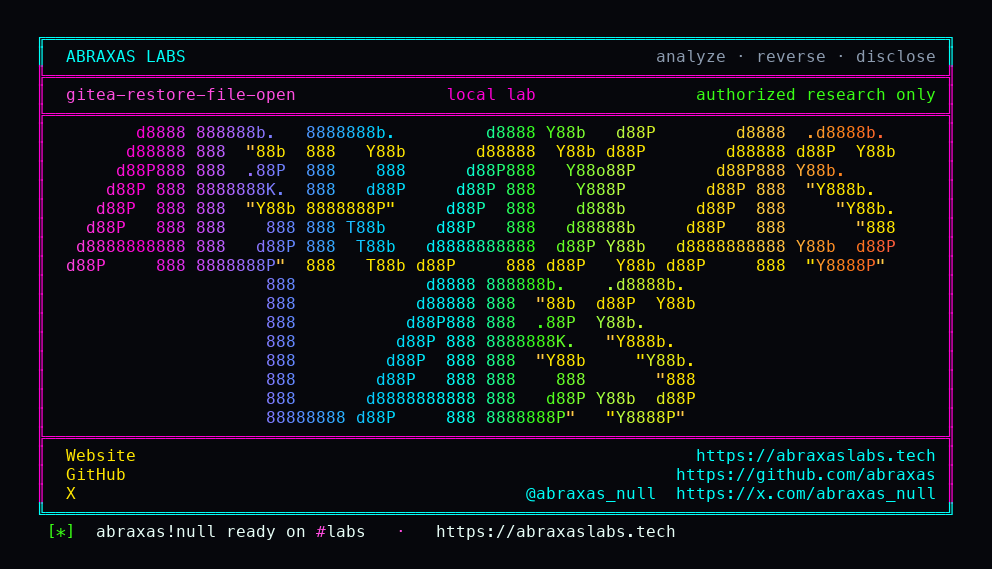

<p align="center">
  
</p>

<p align="center">
  <a href="https://abraxaslabs.tech"><strong>abraxaslabs.tech</strong></a>
  &nbsp;·&nbsp;
  <a href="https://github.com/abraxas">github.com/abraxas</a>
  &nbsp;·&nbsp;
  <a href="https://x.com/abraxas_null">@abraxas_null</a>
  &nbsp;·&nbsp;
  <a href="https://github.com/abraxas/gitea-restore-file-open">gitea-restore-file-open</a>
</p>

# gitea-restore-file-open

**Gitea** `1.27.3` — Gitea

Unpublished Gitea source finding: restore-repo file:// os.Open LFI (dump symlink).

| | |
|---|---|
| ID | Unpublished Gitea source finding #9 (no CVE yet) |
| CWE | [CWE-73](https://cwe.mitre.org/data/definitions/73.html) |
| CVSS | **Medium: 4.2** `CVSS:3.1/AV:L/AC:L/PR:H/UI:R/S:U/C:H/I:N/A:N` |
| Product | [Gitea](https://github.com/go-gitea/gitea) |
| Affected | all versions **through 1.27.3** (inclusive) |
| Patched | vendor patch — see references |
| Auth | authenticated (see source map) |
| License | [GNU Affero GPL v3.0](LICENSE) |
| Lab | `127.0.0.1` only · vendor/client disclosure pack, not a scanner |

---

## Advisory (from the source map)

modules/uri/uri.go OpenWithClient case file: os.Open. CVE-2026-59765 put a hostmatcher HTTP client on this helper; the file:// branch ignores that client. Finding 8 FilePathJoinAbs dump-root escape FAIL on 1.27.3.

---

## Entry

- **Method:** `CLI`
- **Path:** `gitea restore-repo`
- **Router:** Operator restore-repo. DownloadFunc is nil so uploader calls uri.OpenWithClient file:// → os.Open. os.Open follows dump symlink. FilePathJoinAbs stays under dump on 1.27.3.
- **Notes:** Local operator unpublished Gitea #9 CWE-73 v1.27.3. Witness: restored release attachment bytes GITEA-FILE-OPEN-WITNESS. Not dump-root join escape. Not live-migrate file:// LFI. Not eval. Not a reverse shell.

### Call chain

- `gitea restore-repo --repo_dir /data/restore-dump`
- `release DownloadURL rewritten to file://&lt;dump&gt;/tmp/GITEA-FILE-WITNESS.txt`
- `OpenWithClient file:// → os.Open follows dump symlink`
- `GET /labadmin/restored/releases/download/v1.0/witness.txt`

### Lab preconditions

- Gitea 1.27.3
- Operator runs gitea restore-repo on an untrusted dump
- Dump contains a symlink at the joined-under-dump path

### Witness

restored release attachment body is GITEA-FILE-OPEN-WITNESS

### Not success

- eval/base64/system payload
- reverse shell
- dump-root join escape via absolute DownloadURL
- live migrate file:// LFI
- X-Gitea-Internal-Auth

---

## Patch / remediation

**Do this first:** Apply the vendor patch for **Gitea**. See references.

**Verify after upgrade**

- Re-run `gitea-restore-file-open-Abraxas-Labs.py` against the patched build: the mapped witness must **not** appear.
- Confirm the vendor advisory / changeset in the deployed tree (see references).
- A WAF signature is delay, not a patch.

**If you cannot update immediately**

- Disable or isolate the affected component.
- Hunt for the witness condition on production (new privileged users, unexpected files, injected rows — whatever this CVE's map names).

---

## Reproduction (authorized lab)

Target **only** `http://127.0.0.1:8088` (or the loopback you bound). Do not point this script at the internet.

```bash
python3 gitea-restore-file-open-Abraxas-Labs.py
```

Success is the **witness** above in the response body. Generic 200 HTML is not it.

---

## Lab images

Loopback stack used to reproduce. Official images unless a `Dockerfile` in this folder builds from source.

- [`lab/docker-compose.yml`](lab/docker-compose.yml)
- [`lab/Dockerfile`](lab/Dockerfile)
- [`lab/run.sh`](lab/run.sh)

```bash
cd lab
docker compose up --force-recreate
```

Bind the vulnerable product tree next to Compose if the YAML mounts a local directory (plugin zip / source tag from the version table). Publish nothing except `127.0.0.1`.

---

## References

- [github.com/go-gitea/gitea](https://github.com/go-gitea/gitea) tag v1.27.3

- Abraxas Labs: [abraxaslabs.tech](https://abraxaslabs.tech) · [github.com/abraxas](https://github.com/abraxas) · [@abraxas_null](https://x.com/abraxas_null)

---

## Records (structured)

```
# Gitea unpublished #9 — restore file:// os.Open

CWE: CWE-73
Severity: Medium (source review)

## Description

`OpenWithClient` still implements `file://` with `os.Open`. Operator restore of an untrusted dump rewrites release `DownloadURL` to `file://` under the dump. `os.Open` follows a dump symlink. FilePathJoinAbs does not leave the dump root on 1.27.3.

## Product

Gitea 1.27.3. Lab oracle is GITEA-FILE-OPEN-WITNESS in the restored attachment, not a shell.
```

---

## License

This disclosure pack is licensed under the **GNU Affero General Public License v3.0**. See [LICENSE](LICENSE).

---

## Disclaimer

This pack is for **the vendor, the site owner, and licensed labs**. The script talks to `127.0.0.1`. Using it against systems you do not own is not authorized by Abraxas Labs. No warranty.

<p align="center">
  <a href="https://abraxaslabs.tech">abraxaslabs.tech</a> ·
  <a href="https://github.com/abraxas">github.com/abraxas</a> ·
  <a href="https://x.com/abraxas_null">@abraxas_null</a>
</p>
